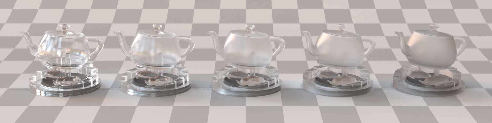
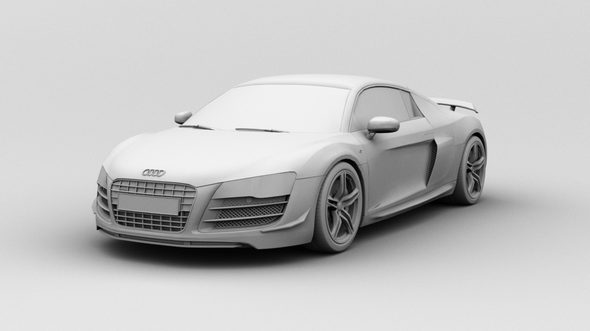
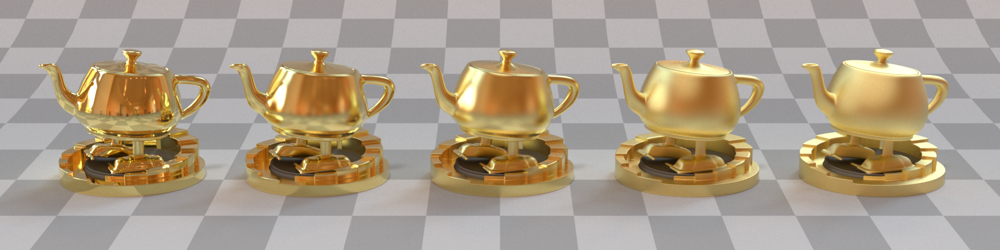

<figure>

</figure>

# Overview
Nenufar (from French <i>Nénuphar</i>) is a physically-based photorealistic 3D renderer I am writing in C++11. It is built on top of [Nori][nori], a distilled version of [Mitsuba][mitsuba], and focuses on global illumination techniques through different light transport algorithms and appearance models. These include unidirectional path tracing with direct light sampling, Veach-style path tracing with multiple importance sampling, microfacets BRDFs and much more. In its current form, Nenufar is still a work in progress, but already supports a number of features as listed below.

  Due to a lot of similarities with my code and the assignments in the course I am currently TA'ing, I am taking my Git repo offline for the semester.

# Implemented features
## Integrators
* Unidirectional path tracing with multiple importance sampling (MIS)
* Direct illumination
* Ambient occlusion
* Surface normals

## Emitters
* Area light
* Point light
* Environment light (with hierarchical sample warping)

## Materials
* Lambertian
* Mirror
* Modified Phong
* Smooth & rough dielectrics
* Rough conductor

## Textures
* Checkerboard
* Bitmap

### Cameras
* Perspective
* Thin lens (with depth of field)

### Geometries
* Mesh (OBJ)
* Analytic sphere

# Gallery

To be updated soon™ when I find time to do some nice renders...

<figure>

<figcaption>A render of a ~600k polygons Audi R8 GT1 model using ambient occlusion. Mesh by <a href="https://www.turbosquid.com/Search/Artists/quads_tris_and_ngons">quads_tris_and_ngons</a>.
</figcaption>
</figure>

<figure>

<figcaption>A render of the official <a href="https://renderman.pixar.com/">Pixar RenderMan</a> teapot using path tracing and an environment light. An isotropic rough conductor BRDF is used to simulate the appearance of gold with varying roughness.
</figcaption>
</figure>

[nori]: https://wjakob.github.io/nori/
[mitsuba]: http://www.mitsuba-renderer.org/
