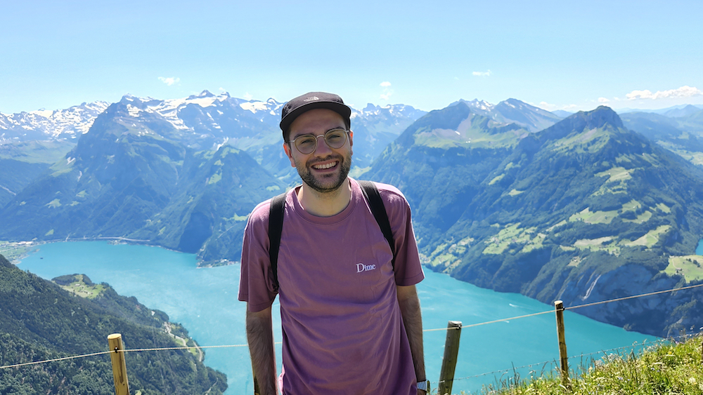

<!-- 

 -->
I earned my Ph.D. from [McGill University][mcgill] in 2024, where I was part of the [McGill Graphics Lab (MGL)][mgl]. I got my B.Sc. from the same university in [Honours Mathematics and Computer Science][math-cs] in 2015 and my M.Eng. in ECE in 2018. I speak both French (native) and English.

Outside of research, I appreciate aesthetics, minimalism, and design of all kinds. I'm a pretty big electronic music head and enjoy house, techno and garage; sometimes [I even record my mixes](https://soundcloud.com/joeylitalien) and [spin some vinyl](https://www.discogs.com/user/milpotent/collection). I was a [soccer referee](https://www.soccerquebec.org/fr/index.html) for more than ten years. Above all, I love problem solving and discovering new algorithms related to rendering, both physics-based and real-time.

If you would like to reach me, shoot me an <a href="mailto:{{site.email}}">email.</a>

<figure>

Somewhere along the <a href="https://www.alltrails.com/trail/switzerland/schwyz/stoos-fronalpstock-klingenstock">Stoos Ridge Hike</a> in Schwyz, Switzerland, June 2022.

</figure>

---
For the typography enthusiasts, font is [San Francisco](https://developer.apple.com/fonts) on macOS, [Segoe UI](https://docs.microsoft.com/en-us/typography/font-list/segoe-ui) on Windows and [Roboto](https://fonts.google.com/specimen/Roboto) on Linux. Icons are mostly from [Tabler](https://tabler-icons.io/). This website was entirely coded with [Jekyll][jekyll]. Styling is my own take on the [Minima](https://github.com/jekyll/minima) Jekyll theme. Also note that despite my last name, I am _not_ Italian (but I do like pasta).

[math-cs]: http://www.mcgill.ca/study/2013-2014/faculties/science/undergraduate/programs/bachelor-science-bsc-joint-honours-mathematics-and-computer
[mcgill]: http://www.mcgill.ca
[garneau]: http://www.cegepgarneau.ca
[henriette]: https://www.fonts.com/font/typejockeys/henriette
[franklin]: https://www.fonts.com/font/urw/franklin-gothic/urw-complete-family-pack
[incol]: https://fonts.google.com/specimen/Inconsolata
[jekyll]: https://jekyllrb.com/
[typekit]: https://typekit.com/
[mgl]: http://gfx.lab.mcgill.ca/
[summ]: http://summ.math.uqam.ca/?lang=en
[discogs]: https://www.discogs.com/user/milpotent/collection

